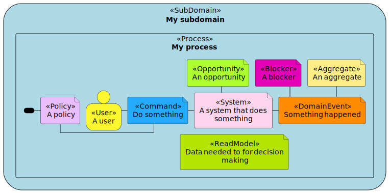
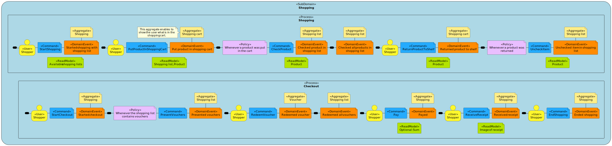
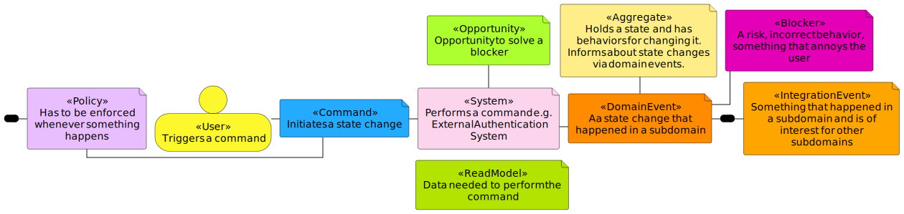
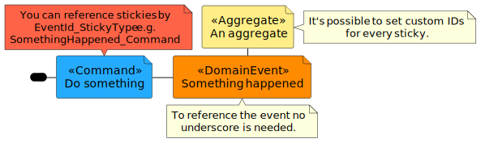
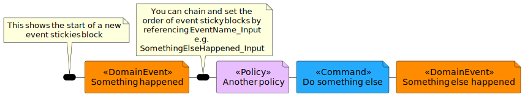

# event-storming-puml
[](https://github.com/dreamsinbits/event-storming-puml/actions/workflows/positive_tests.yml) [](https://github.com/dreamsinbits/event-storming-puml/actions/workflows/negative_tests.yml) [](https://github.com/dreamsinbits/event-storming-puml/actions/workflows/export_examples.yml)

Library for creating EventStorming diagrams with PlantUML.

This library adheres as closely as possible to the concepts described in the book 
["Introducing EventStorming"](https://leanpub.com/introducing_eventstorming) by Alberto Brandolini.
It is intended to be used for digitizing EventStorming meetings that have taken place in person or for remote EventStorming sessions.
The design of the library allows you to start with a big picture and then to enrich the diagram with more details like commands, 
aggregates or users, 
as more information about the domain is obtained.
Finally,
it's possible to group the stickies into subdomains and processes.




## How to Use
To use the EventStorming stickies from this library, 
simply include the `EventStorming.iuml` file in your PlantUML diagram:

```
@startuml

!includeurl https://raw.githubusercontent.com/dreamsinbits/event-storming-puml/refs/heads/main/src/EventStorming.iuml
...

@enduml
```

If you want to use this library offline, you can clone this repo and include it in your PlantUML diagram locally.
But keep in mind that the EventStorming.iuml file references other files via URLs,
so you would need to change that to local paths.
This is something I'm planning to improve in the future.

```
@startuml

!include your/path/EventStorming.iuml
...

@enduml
```
### Examples
Refer to the [examples](examples) and [tests](tests) folders for examples.

## Functionality
To add a `DomainEvent` or `IntegrationEvent` to your diagram, use the following syntax:

```
DomainEvent('Your Domain Event name', YourDomainEventId)
IntegrationEvent('Your Integration Event name', YourIntegrationEventId)
```

This event block can be enriched by:
- `Command`
- `Aggregate`
- `Policy`
- `System`
- `User`
- `ReadModel`

To do so, simply add them as parameters to the `DomainEvent` block.
The order of the parameters does not matter,
but are limited to one of each type per `DomainEvent` block.

```plantuml
@startuml
!includeurl https://raw.githubusercontent.com/dreamsinbits/event-storming-puml/refs/heads/main/src/EventStorming.iuml

DomainEvent('Your Domain Event name', YourDomainEventId, $Command('Your command'), $Aggregate('Your aggregate'), $Policy('Your policy'), $System('Your system'), $User('Your user'), $ReadModel('Your read model'))
@enduml
```

If you need more than one of a specific type,
you can add them separately.
Blockers and Opportunities can be added in the same way.

```plantuml
@startuml
!includeurl https://raw.githubusercontent.com/dreamsinbits/event-storming-puml/refs/heads/main/src/EventStorming.iuml

Command('Your command', YourCommandId)
Aggregate('Your command', YourCommandId)
Blocker('Your blocker', YourBlockerId)
Opportunity('Your opportunity', YourOpportunityId)

@enduml
```

### Supported Stickies
This image shows all supported stickies and their explanations.
The code is available [here](examples/AllStickies.puml).



### Referencing
There is an ID generated for each sticky to enable easy referencing.
Each sticky defined in a `DomainEvent` or `IntegrationEvent` gets an ID with the pattern `EventId_StickyType`. 
So for example, if you define a `DomainEvent` like this:
```
DomainEvent('SomethingHappened', SomethingHappened, $Command('DoSomething'))
```
The command gets the ID `SomethingHappened_Command` and it is possible to reference it like this:

```plantuml
@startuml
!includeurl https://raw.githubusercontent.com/dreamsinbits/event-storming-puml/refs/heads/main/src/EventStorming.iuml

DomainEvent('Something happened', SomethingHappened, $Command('Do something'), $Aggregate('An aggregate', AnAggregate))

note "You can reference stickies by EventId_StickyType e.g. SomethingHappened_Command" as CommandNote #Tomato
note "To reference the event no underscore is needed." as EventNote
note "It's possible to set custom IDs for every sticky." as AggregateNote

CommandNote -- SomethingHappened_Command
SomethingHappened -- EventNote
AnAggregate - AggregateNote

@enduml
```



### Chaining
Each event block gets an input node that is always placed on the left most side of the block.
You can reference this input node by its ID `EventId_Input` to chain event blocks and to ensure a specific order:

```plantuml
@startuml
!includeurl https://raw.githubusercontent.com/dreamsinbits/event-storming-puml/refs/heads/main/src/EventStorming.iuml

DomainEvent('Something happened', SomethingHappened)

DomainEvent('Something else happened', SomethingElseHappened, $Command('Do something else'), $Policy('Another policy'))

note "This shows the start of a new event stickies block" as InputNote
note "You can chain and set the order of event sticky blocks by referencing EventName_Input e.g. SomethingElseHappened_Input" as ChainNote

SomethingHappened - SomethingElseHappened_Input

InputNote -- SomethingHappened_Input
ChainNote -- SomethingElseHappened_Input

@enduml
```



### Subdomains and Processes
To group stickies into subdomains and processes,
you can use the `SubDomain` and `Process` blocks:

```plantuml
@startuml
!includeurl https://raw.githubusercontent.com/dreamsinbits/event-storming-puml/refs/heads/main/src/EventStorming.iuml

SubDomain('My subdomain', MySubdomain) {
    Process('My process', MyProcess) {
        DomainEvent('Something happened', SomethingHappened, $Command('Do something'), $Aggregate('An aggregate'), $Policy('A policy'), $System('A system that does something'), $User('A user'), $ReadModel('Data needed to for decision making'))
        Blocker('A blocker', ABlocker)
        Opportunity('An opportunity', AnOpportunity)

        AnOpportunity -- SomethingHappened_System
        ABlocker -- SomethingHappened
    }
}

@enduml
```


## Tips and Tricks
- If your diagrams become too large to view, 
  you can split them in `subs` by `!startsub SubName` and `!endsub`. 
  In this way you still have one large diagram with everything in it,
  but also smaller diagrams that are easier to view.
  A good practice could be to split each subdomain into a separate sub.
  Refer to [EventStormingShoppingElephant.puml](examples/EventStormingShoppingElephant.puml) and 
  [ShoppingElephantShopping.puml](examples/ShoppingElephantShopping.puml) for an example.

## Credits
I started this project after I saw the [plantuml-lib](https://github.com/tmorin/plantuml-libs) from [Thibault Morin](https://github.com/tmorin).
Thank you for the inspiration!